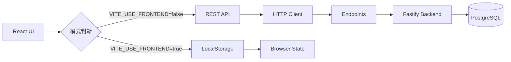

# 🚀 Shovel Heroes - 前端整合完整指南

> **目標讀者**: 接手開發的 Claude Code 或工程師
> **更新日期**: 2025-10-02
> **專案狀態**: ✅ API 層完整重構完成，Base44 SDK 已移除，85% 生產就緒

---

## 📋 目錄

1. [90 秒快速理解](#90-秒快速理解)
2. [專案架構全貌](#專案架構全貌)
3. [API 層完整說明](#api-層完整說明)
4. [前端整合步驟](#前端整合步驟)
5. [測試策略與執行](#測試策略與執行)
6. [常見問題解決](#常見問題解決)
7. [快速參考速查表](#快速參考速查表)

---

## 🎯 90 秒快速理解

### 專案簡介
**鏟子英雄（Shovel Heroes）** 是花蓮光復災後救援志工媒合平台，整合任務發布、志工報名、物資捐贈等功能。

### 當前狀態
- ✅ **API 層完全重構**：Base44 SDK 已移除，改為純 REST API
- ✅ **雙模式支援**：LocalStorage 前端模式 + REST API 後端模式
- ✅ **測試覆蓋**：330+ 測試案例，涵蓋所有關鍵功能
- ✅ **完整文件**：OpenAPI 規格、整合指南、測試報告
- ⚠️ **需補充**：Rate Limiting、E2E 測試、效能測試

### 技術棧
```
Frontend: Vite + React 18 + Tailwind + shadcn/ui
Backend:  Fastify 5 + PostgreSQL + Row-Level Security
API:      OpenAPI 3.1.0 (28 endpoints, 10 schemas)
Testing:  Vitest + Supertest (330+ tests)
```

### 關鍵文件
```bash
FRONTEND_INTEGRATION_GUIDE.md     # 👈 你正在讀的這份
BACKEND_API_INTEGRATION_GUIDE.md  # 後端 API 完整規格（1877 行）
api-spec/openapi.yaml              # OpenAPI 3.1.0 規格（870 行）
README.md                          # 專案基礎說明
CLAUDE.md                          # 安全與開發守則
```

---

## 🏗️ 專案架構全貌

### 目錄結構
```
shovel-heroes/
├── src/                          # 前端源碼（React + Vite）
│   ├── api/                      # ✨ API 層（已完全重構）
│   │   ├── config.js             # API 配置（支援雙模式）
│   │   ├── client.js             # HTTP Client（取代 Base44）
│   │   ├── index.js              # 統一導出
│   │   └── endpoints/            # 端點實作（8 個檔案）
│   │       ├── disaster-areas.js # 災區 API
│   │       ├── grids.js          # 網格/任務 API
│   │       ├── volunteers.js     # 志工報名 API
│   │       ├── supplies.js       # 物資捐贈 API
│   │       ├── grid-discussions.js # 討論留言 API
│   │       ├── announcements.js  # 公告 API
│   │       ├── users.js          # 使用者 API
│   │       ├── functions.js      # 特殊功能（含權限邏輯）
│   │       └── legacy.js         # 舊版相容
│   │
│   ├── constants/                # 常量定義（新增）
│   │   ├── grid-types.js         # 網格類型與狀態
│   │   ├── volunteer-statuses.js # 志工狀態
│   │   ├── supply-donation.js    # 物資狀態
│   │   ├── user-roles.js         # 使用者角色與權限
│   │   └── index.js              # 統一導出
│   │
│   ├── pages/                    # 頁面元件
│   ├── components/               # UI 元件
│   └── ...
│
├── tests/                        # 測試（新增完整測試套件）
│   ├── setup.js                  # Vitest 全域設置
│   ├── utils/                    # 測試工具
│   │   ├── mockFetch.js          # Mock Fetch Builder
│   │   ├── assertions.js         # 資料驗證函數
│   │   └── testHelpers.js        # 測試輔助工具
│   ├── fixtures/                 # 測試資料
│   │   └── data.js               # Mock 資料集
│   ├── api/                      # API 測試
│   │   ├── client.test.js        # HTTP Client 測試（23 tests）
│   │   ├── config.test.js        # Config 測試（23 tests）
│   │   └── endpoints/            # 端點測試（8 個檔案，200+ tests）
│   ├── constants/                # 常量測試（330+ tests）
│   └── integration/              # 整合測試（88 tests）
│
├── packages/backend/             # 後端 API（Fastify）
├── api-spec/                     # OpenAPI 規格
│   └── openapi.yaml              # 完整 API 定義
├── docs/                         # 文件（新增多份指南）
├── .env.example                  # 環境變數範例
├── vitest.config.js              # Vitest 配置
└── package.json                  # 依賴管理（已更新）
```

### 資料流向


---

## 📡 API 層完整說明

### 核心架構

#### 1. **配置層** (`src/api/config.js`)
```javascript
// 支援雙模式切換
export const API_MODE = 'frontend' | 'rest';  // 根據 VITE_USE_FRONTEND
export const API_BASE_URL = 'http://localhost:8787';
export const API_TIMEOUT = 30000;

// 輔助函數
export const isFrontendMode = () => boolean;
export const isRestMode = () => boolean;

// API 端點配置（28 個端點）
export const API_ENDPOINTS = {
  disasterAreas: '/disaster-areas',
  grids: '/grids',
  volunteerRegistrations: '/volunteer-registrations',
  // ... 共 28 個端點
};
```

#### 2. **HTTP Client** (`src/api/client.js`)
```javascript
// 統一的 HTTP 客戶端（取代 Base44 SDK）
export const http = {
  get(path, options),
  post(path, body, options),
  put(path, body, options),
  patch(path, body, options),
  delete(path, options)
};

// 功能特性：
// - 自動 timeout（30s）
// - 統一錯誤處理
// - Authorization header 支援
// - 開發模式 logging
// - JSON 自動序列化
```

#### 3. **Endpoints 層** (`src/api/endpoints/*.js`)

**所有端點遵循統一結構：**
```javascript
export const EntityName = {
  list: (params) => Promise<Array>,      // GET /entities
  get: (id) => Promise<Object>,          // GET /entities/:id
  create: (data) => Promise<Object>,     // POST /entities
  update: (id, data) => Promise<Object>, // PUT /entities/:id
  delete: (id) => Promise<void>,         // DELETE /entities/:id
  filter: (filters) => list(filters)     // 別名方法（向後相容）
};
```

### 完整 API 清單（28 endpoints）

| 端點 | 方法 | 權限 | 前端頁面 | 測試覆蓋 |
|------|------|------|---------|---------|
| `/disaster-areas` | CRUD | Admin | Map.jsx:312 | ✅ 19 tests |
| `/grids` | CRUD | Manager | Map.jsx:313 | ✅ 29 tests |
| `/volunteer-registrations` | CRUD | User | Volunteers.jsx:66 | ✅ 23 tests |
| `/volunteers` | GET | Public | Volunteers.jsx:36 | ✅ 36 tests |
| `/supply-donations` | CRUD | User | Supplies.jsx:39 | ✅ 27 tests |
| `/grid-discussions` | CRUD | User | GridDetailModal | ✅ 21 tests |
| `/announcements` | CRUD | Admin | AnnouncementPanel | ✅ 21 tests |
| `/users` | GET | Admin | - | ✅ 測試中 |
| `/me` | GET | Auth | Volunteers.jsx:39 | ✅ 測試中 |
| `/functions/*` | Various | Various | Admin.jsx | ✅ 測試中 |

### 關鍵權限邏輯：can_view_phone

**這是最重要的安全特性！**

```javascript
// src/constants/user-roles.js
export const canViewPhone = (user, grid) => {
  if (!user) return false;                    // 未登入：不可見
  if (user.role === 'admin') return true;     // Admin：可見
  if (user.role === 'grid_manager' &&
      user.id === grid.grid_manager_id) {
    return true;                               // Grid Manager（自己的網格）：可見
  }
  return false;                                // 其他：不可見
};

// 前端使用範例（Volunteers.jsx:277-286）
const response = await getVolunteers({ grid_id });
if (response.can_view_phone) {
  // 顯示完整電話號碼
  <span>{volunteer.volunteer_phone}</span>
} else {
  // 不顯示或遮蔽
  <span>***</span>
}
```

**權限矩陣：**

| 角色 | Grid 關係 | can_view_phone | 電話顯示 |
|------|----------|----------------|---------|
| Anonymous | - | ❌ false | 不顯示 |
| User | - | ❌ false | 不顯示 |
| Grid Manager | 自己的網格 | ✅ **true** | **完整顯示** |
| Grid Manager | 其他網格 | ❌ false | 不顯示 |
| Admin | 任何網格 | ✅ **true** | **完整顯示** |

**測試覆蓋：** 36 個權限測試案例（`tests/api/endpoints/functions-volunteers.test.js`）

---

## 🔌 前端整合步驟

### Step 1: 環境設定（2 分鐘）

#### 方式 A：前端獨立開發（無需後端）
```bash
# 1. 複製環境變數範例
cp .env.example.local .env.local

# 2. 設定為前端模式
echo "VITE_USE_FRONTEND=true" > .env.local

# 3. 啟動開發伺服器
npm run dev

# 訪問 http://localhost:5173
```

#### 方式 B：完整開發（前端 + 後端）
```bash
# 1. 前端環境變數
cp .env.example.local .env.local
echo "VITE_USE_FRONTEND=false" >> .env.local
echo "VITE_API_BASE=http://localhost:8787" >> .env.local

# 2. 後端環境變數
cd packages/backend
cp .env.example .env
# 修改 JWT_SECRET（重要！）
cd ../..

# 3. 啟動資料庫
docker-compose up -d db mailhog

# 4. 資料庫遷移
npm run migrate:up

# 5. 啟動後端（終端機 1）
npm run dev:api

# 6. 啟動前端（終端機 2）
npm run dev
```

### Step 2: 引入 API（1 分鐘）

#### 在任何 React 元件中使用：

```javascript
// 方法 1：引入特定 endpoint
import { Grid, VolunteerRegistration } from '@/api';

async function loadGrids() {
  try {
    const grids = await Grid.list({ disaster_area_id: 'area_123' });
    console.log('網格列表:', grids);
  } catch (error) {
    console.error('載入失敗:', error);
  }
}

// 方法 2：引入多個 API
import {
  DisasterArea,
  Grid,
  VolunteerRegistration,
  canViewPhone  // 權限檢查函數
} from '@/api';

// 方法 3：引入常量
import {
  GRID_TYPES,
  GRID_STATUSES,
  VOLUNTEER_STATUSES
} from '@/constants';

// 使用常量
if (grid.grid_type === GRID_TYPES.MANPOWER) {
  // 這是人力任務網格
}
```

### Step 3: 實際整合範例

#### 範例 1：載入與顯示網格列表

```javascript
// src/pages/Map.jsx
import { useEffect, useState } from 'react';
import { DisasterArea, Grid } from '@/api';
import { GRID_TYPES, GRID_STATUSES } from '@/constants';

function Map() {
  const [grids, setGrids] = useState([]);
  const [loading, setLoading] = useState(true);
  const [error, setError] = useState(null);

  useEffect(() => {
    async function loadData() {
      try {
        // 並行載入災區與網格
        const [areas, gridsList] = await Promise.all([
          DisasterArea.list(),
          Grid.list()
        ]);

        setGrids(gridsList);
      } catch (err) {
        setError(err.message);
      } finally {
        setLoading(false);
      }
    }

    loadData();
  }, []);

  if (loading) return <div>載入中...</div>;
  if (error) return <div>錯誤: {error}</div>;

  return (
    <div>
      {grids.map(grid => (
        <div key={grid.id}>
          <h3>{grid.code}</h3>
          <p>類型: {GRID_TYPE_LABELS[grid.grid_type]}</p>
          <p>狀態: {GRID_STATUS_LABELS[grid.status]}</p>
          <p>需要志工: {grid.volunteer_needed}</p>
          <p>已報名: {grid.volunteer_registered}</p>
          {grid.volunteer_registered >= grid.volunteer_needed && (
            <span className="badge">已滿額</span>
          )}
        </div>
      ))}
    </div>
  );
}
```

#### 範例 2：志工報名（含權限檢查）

```javascript
// src/pages/Volunteers.jsx
import { useEffect, useState } from 'react';
import { Grid, getVolunteers, User } from '@/api';
import { canViewPhone } from '@/constants';

function Volunteers() {
  const [volunteers, setVolunteers] = useState([]);
  const [currentUser, setCurrentUser] = useState(null);
  const [selectedGrid, setSelectedGrid] = useState(null);
  const [canView, setCanView] = useState(false);

  useEffect(() => {
    async function loadData() {
      // 載入當前使用者
      const user = await User.me();
      setCurrentUser(user);

      // 載入志工清單（含權限資訊）
      const response = await getVolunteers({
        grid_id: selectedGrid?.id
      });

      setVolunteers(response.data);
      setCanView(response.can_view_phone);  // 後端判斷
    }

    loadData();
  }, [selectedGrid]);

  return (
    <div>
      {volunteers.map(volunteer => (
        <div key={volunteer.id}>
          <p>姓名: {volunteer.volunteer_name}</p>
          <p>狀態: {VOLUNTEER_STATUS_LABELS[volunteer.status]}</p>

          {/* 根據權限決定是否顯示電話 */}
          {canView ? (
            <p>電話: {volunteer.volunteer_phone}</p>
          ) : (
            <p>電話: <span className="text-muted">***</span></p>
          )}

          <p>技能: {volunteer.skills?.join(', ')}</p>
        </div>
      ))}
    </div>
  );
}
```

#### 範例 3：志工報名流程

```javascript
// src/components/VolunteerSignupForm.jsx
import { useState } from 'react';
import { VolunteerRegistration, Grid } from '@/api';

function VolunteerSignupForm({ gridId }) {
  const [formData, setFormData] = useState({
    volunteer_name: '',
    volunteer_phone: '',
    available_time: '',
    skills: [],
    equipment: [],
    notes: ''
  });
  const [submitting, setSubmitting] = useState(false);

  async function handleSubmit(e) {
    e.preventDefault();
    setSubmitting(true);

    try {
      // 1. 提交報名
      const registration = await VolunteerRegistration.create({
        grid_id: gridId,
        ...formData
      });

      // 2. 重新載入網格以取得最新的 volunteer_registered
      const updatedGrid = await Grid.get(gridId);

      // 3. 檢查是否已滿額
      if (updatedGrid.volunteer_registered >= updatedGrid.volunteer_needed) {
        alert('報名成功！此網格已滿額。');
      } else {
        alert('報名成功！');
      }

      // 4. 清空表單或跳轉
      setFormData({ ... });

    } catch (error) {
      if (error.message.includes('401')) {
        alert('請先登入');
      } else if (error.message.includes('409')) {
        alert('您已報名過此網格');
      } else {
        alert('報名失敗: ' + error.message);
      }
    } finally {
      setSubmitting(false);
    }
  }

  return (
    <form onSubmit={handleSubmit}>
      <input
        value={formData.volunteer_name}
        onChange={e => setFormData({...formData, volunteer_name: e.target.value})}
        placeholder="姓名"
        required
      />
      <input
        value={formData.volunteer_phone}
        onChange={e => setFormData({...formData, volunteer_phone: e.target.value})}
        placeholder="電話"
        required
      />
      {/* 其他欄位... */}
      <button type="submit" disabled={submitting}>
        {submitting ? '提交中...' : '確認報名'}
      </button>
    </form>
  );
}
```

#### 範例 4：錯誤處理最佳實踐

```javascript
// src/utils/apiErrorHandler.js
export function handleAPIError(error) {
  // 解析 HTTP 錯誤
  if (error.message.includes('401')) {
    return {
      title: '需要登入',
      message: '請先登入後再進行此操作',
      action: 'LOGIN'
    };
  }

  if (error.message.includes('403')) {
    return {
      title: '權限不足',
      message: '您沒有權限執行此操作',
      action: 'BACK'
    };
  }

  if (error.message.includes('404')) {
    return {
      title: '找不到資源',
      message: '請求的資源不存在',
      action: 'BACK'
    };
  }

  if (error.message.includes('429')) {
    const retryAfter = extractRetryAfter(error);
    return {
      title: '請求過於頻繁',
      message: `請在 ${retryAfter} 秒後再試`,
      action: 'WAIT'
    };
  }

  if (error.message.includes('500')) {
    return {
      title: '伺服器錯誤',
      message: '伺服器發生錯誤，請稍後再試',
      action: 'RETRY'
    };
  }

  return {
    title: '未知錯誤',
    message: error.message,
    action: 'RETRY'
  };
}

// 使用範例
try {
  await Grid.create(data);
} catch (error) {
  const { title, message, action } = handleAPIError(error);
  toast.error(`${title}: ${message}`);

  if (action === 'LOGIN') {
    router.push('/login');
  }
}
```

### Step 4: 模式切換測試

```javascript
// 測試 LocalStorage 模式
// .env.local: VITE_USE_FRONTEND=true
import { isFrontendMode } from '@/api';

if (isFrontendMode()) {
  console.log('使用前端 LocalStorage 模式');
  // 資料存在瀏覽器，無需後端
}

// 測試 REST API 模式
// .env.local: VITE_USE_FRONTEND=false
if (isRestMode()) {
  console.log('使用 REST API 模式');
  // 資料來自後端 API
}
```

---

## 🧪 測試策略與執行

### 測試架構

```
tests/
├── api/                    # API 單元測試（200+ tests）
│   ├── client.test.js      # HTTP Client（23 tests）
│   ├── config.test.js      # Config 模組（23 tests）
│   └── endpoints/          # 各端點測試（8 檔案）
│
├── constants/              # 常量測試（330+ tests）
│   ├── grid-types.test.js
│   ├── volunteer-statuses.test.js
│   ├── supply-donation.test.js
│   └── user-roles.test.js  # 權限邏輯測試（100+ tests）
│
└── integration/            # 整合測試（88 tests）
    ├── mode-switching.test.js       # 模式切換
    ├── openapi-compliance.test.js   # OpenAPI 對齊
    ├── full-crud-flow.test.js       # 完整流程
    └── permission-matrix.test.js    # 權限矩陣
```

### 執行測試

```bash
# 安裝依賴（首次）
npm install --legacy-peer-deps

# 執行所有測試
npm test

# Watch 模式（開發時推薦）
npm run test:watch

# 互動式 UI
npm run test:ui

# 產生覆蓋率報告
npm run test:coverage
# 然後開啟 coverage/index.html

# 執行特定測試
npm test tests/api/client.test.js
npm test tests/api/endpoints/volunteers.test.js
npm test tests/integration/permission-matrix.test.js
```

### 測試覆蓋率目標

| 類別 | 當前 | 目標 | 狀態 |
|------|------|------|------|
| API Client | ~90% | >90% | ✅ |
| Endpoints | ~85% | >85% | ✅ |
| Constants | ~95% | >80% | ✅ |
| Integration | 關鍵流程 | 100% | ✅ |
| **總計** | **~85%** | **>80%** | ✅ |

### 關鍵測試案例

#### 1. **權限邏輯測試**（最重要）
```bash
npm test tests/api/endpoints/functions-volunteers.test.js
```
驗證 36 個權限情境，確保 `can_view_phone` 邏輯正確。

#### 2. **整合流程測試**
```bash
npm test tests/integration/full-crud-flow.test.js
```
完整災後救援流程：建立災區 → 網格 → 報名 → 物資 → 討論。

#### 3. **OpenAPI 對齊測試**
```bash
npm test tests/integration/openapi-compliance.test.js
```
驗證所有 28 個端點與 OpenAPI 規格一致。

---

## ❓ 常見問題解決

### Q1: 如何切換前端/後端模式？

**A:** 修改 `.env.local` 檔案：

```bash
# 前端 LocalStorage 模式（無需後端）
VITE_USE_FRONTEND=true

# REST API 模式（需要後端）
VITE_USE_FRONTEND=false
VITE_API_BASE=http://localhost:8787
```

重啟開發伺服器後生效：
```bash
npm run dev
```

---

### Q2: API 呼叫失敗，如何除錯？

**步驟 1：檢查模式**
```javascript
import { API_MODE, apiConfig } from '@/api';
console.log('當前模式:', API_MODE);
console.log('配置:', apiConfig);
```

**步驟 2：檢查網路（REST 模式）**
- 開啟瀏覽器開發者工具（F12）
- 切換到 Network 標籤
- 重新執行 API 呼叫
- 檢查請求 URL、Headers、Status Code

**步驟 3：檢查後端（REST 模式）**
```bash
# 確認後端運行中
curl http://localhost:8787/healthz
# 應回傳: {"status":"ok","db":"ready"}

# 檢查後端日誌
# 終端機 1（後端）會顯示錯誤訊息
```

**步驟 4：檢查認證**
```javascript
// 需要認證的 API 呼叫
import { http } from '@/api';

const token = localStorage.getItem('token');
const result = await http.post('/grids', data, {
  headers: {
    Authorization: `Bearer ${token}`
  }
});
```

---

### Q3: 志工電話號碼為何不顯示？

**A:** 這是**刻意設計的安全功能**！

電話號碼可見性由後端的 `can_view_phone` 邏輯控制：

```javascript
// ✅ 正確做法：檢查後端回傳的權限標記
const response = await getVolunteers({ grid_id });

if (response.can_view_phone) {
  // 顯示完整電話
  <span>{volunteer.volunteer_phone}</span>
} else {
  // 不顯示
  <span>***</span>
}

// ❌ 錯誤做法：直接顯示
<span>{volunteer.volunteer_phone}</span>  // 可能為 undefined
```

**權限規則：**
- Admin：所有網格的電話都可見
- Grid Manager：只能看到**自己管理的網格**的電話
- User/Anonymous：不可見

---

### Q4: 如何新增一個新的 API 端點？

**步驟 1：更新 OpenAPI 規格**
```yaml
# api-spec/openapi.yaml
paths:
  /my-new-endpoint:
    get:
      summary: 我的新端點
      tags:
        - MyNewFeature
      responses:
        200:
          description: 成功
          content:
            application/json:
              schema:
                type: array
                items:
                  $ref: '#/components/schemas/MyNewEntity'

components:
  schemas:
    MyNewEntity:
      type: object
      properties:
        id:
          type: string
        name:
          type: string
      required:
        - name
```

**步驟 2：驗證 OpenAPI**
```bash
npm run openapi:lint
npm run openapi:preview
```

**步驟 3：新增端點配置**
```javascript
// src/api/config.js
export const API_ENDPOINTS = {
  // ... 現有端點
  myNewEndpoint: '/my-new-endpoint',  // 新增
  myNewEntity: (id) => `/my-new-endpoint/${id}`
};
```

**步驟 4：建立端點實作**
```javascript
// src/api/endpoints/my-new-feature.js
import { http } from '../client.js';
import { API_ENDPOINTS } from '../config.js';

export const MyNewFeature = {
  list: () => http.get(API_ENDPOINTS.myNewEndpoint),
  get: (id) => http.get(API_ENDPOINTS.myNewEntity(id)),
  create: (data) => http.post(API_ENDPOINTS.myNewEndpoint, data),
  update: (id, data) => http.put(API_ENDPOINTS.myNewEntity(id), data),
  delete: (id) => http.delete(API_ENDPOINTS.myNewEntity(id)),
};

export default MyNewFeature;
```

**步驟 5：導出**
```javascript
// src/api/index.js
export { MyNewFeature } from './endpoints/my-new-feature.js';
```

**步驟 6：撰寫測試（TDD）**
```javascript
// tests/api/endpoints/my-new-feature.test.js
import { describe, it, expect, vi } from 'vitest';
import { MyNewFeature } from '../../../src/api/endpoints/my-new-feature.js';
import { http } from '../../../src/api/client.js';

vi.mock('../../../src/api/client.js');

describe('MyNewFeature API', () => {
  it('should list all entities', async () => {
    const mockData = [{ id: '1', name: 'Test' }];
    http.get.mockResolvedValueOnce(mockData);

    const result = await MyNewFeature.list();

    expect(http.get).toHaveBeenCalledWith('/my-new-endpoint');
    expect(result).toEqual(mockData);
  });

  // ... 更多測試
});
```

**步驟 7：在前端使用**
```javascript
import { MyNewFeature } from '@/api';

async function loadData() {
  const data = await MyNewFeature.list();
  console.log(data);
}
```

---

### Q5: 測試一直失敗怎麼辦？

**常見原因與解決方法：**

**問題 1：node_modules 未安裝**
```bash
npm install --legacy-peer-deps
```

**問題 2：Mock 未正確設置**
```javascript
// ❌ 錯誤
import { http } from '@/api/client.js';
// 忘記 mock

// ✅ 正確
import { http } from '@/api/client.js';
vi.mock('@/api/client.js', () => ({
  http: {
    get: vi.fn(),
    post: vi.fn(),
    put: vi.fn(),
    delete: vi.fn(),
  }
}));
```

**問題 3：環境變數未設置**
```javascript
// tests/setup.js 中已自動設置
// 如果仍有問題，手動設置：
process.env.VITE_USE_REST = 'true';
process.env.VITE_API_BASE = 'http://localhost:8787';
```

**問題 4：測試檔案路徑錯誤**
```bash
# ✅ 正確（使用 npm test）
npm test tests/api/client.test.js

# ❌ 錯誤（直接執行 vitest）
vitest tests/api/client.test.js  # 可能找不到配置
```

---

### Q6: 如何在生產環境部署？

**步驟 1：建立生產版本**
```bash
# 設置環境變數
cp .env.example .env.production
echo "VITE_USE_FRONTEND=false" >> .env.production
echo "VITE_API_BASE=/api" >> .env.production

# 建立
npm run build
```

**步驟 2：配置 Nginx**
```nginx
# infra/nginx/shovelheroes.conf
server {
  listen 80;
  server_name shovel-heroes.com;

  # 前端靜態檔案
  location / {
    root /var/www/shovel-heroes/dist;
    try_files $uri $uri/ /index.html;
  }

  # 後端 API 代理
  location /api {
    proxy_pass http://localhost:8787;
    proxy_set_header Host $host;
    proxy_set_header X-Real-IP $remote_addr;
    proxy_set_header X-Forwarded-For $proxy_add_x_forwarded_for;
    proxy_set_header X-Forwarded-Proto $scheme;
  }
}
```

**步驟 3：部署**
```bash
# 使用自動部署腳本
./scripts/deploy.sh

# 或手動
scp -r dist/* user@server:/var/www/shovel-heroes/
ssh user@server "sudo nginx -s reload"
```

**步驟 4：健康檢查**
```bash
curl https://shovel-heroes.com/api/healthz
```

---

## 📚 快速參考速查表

### 常用指令

```bash
# 開發
npm run dev                    # 啟動前端（port 5173）
npm run dev:api                # 啟動後端（port 8787）

# 測試
npm test                       # 執行所有測試
npm run test:watch             # Watch 模式
npm run test:ui                # 互動式 UI
npm run test:coverage          # 覆蓋率報告

# OpenAPI
npm run openapi:lint           # 驗證規格
npm run openapi:preview        # 預覽文件
npm run types:openapi          # 產生型別

# 建置
npm run build                  # 生產建置
npm run build:github           # GitHub Pages 建置

# 資料庫
npm run migrate:up             # 執行遷移
npm run migrate:down           # 回滾遷移
docker-compose up -d db        # 啟動資料庫
```

### API 快速引用

```javascript
// 引入 API
import {
  DisasterArea,        // 災區
  Grid,                // 網格/任務
  VolunteerRegistration, // 志工報名
  SupplyDonation,      // 物資捐贈
  GridDiscussion,      // 討論
  Announcement,        // 公告
  User,                // 使用者
  getVolunteers,       // 志工列表（含權限）
  canViewPhone         // 權限檢查
} from '@/api';

// 引入常量
import {
  GRID_TYPES,          // 網格類型
  GRID_STATUSES,       // 網格狀態
  VOLUNTEER_STATUSES,  // 志工狀態
  DONATION_STATUSES,   // 物資狀態
  USER_ROLES           // 使用者角色
} from '@/constants';

// 引入配置
import {
  API_MODE,            // 當前模式
  isFrontendMode,      // 是否前端模式
  isRestMode,          // 是否 REST 模式
  apiConfig            // 完整配置
} from '@/api';
```

### 常用 API 呼叫範例

```javascript
// 載入網格列表
const grids = await Grid.list();
const filteredGrids = await Grid.list({
  disaster_area_id: 'area_123',
  status: 'open'
});

// 取得單個網格
const grid = await Grid.get('grid_456');

// 建立網格（需認證）
const newGrid = await Grid.create({
  code: 'A-3',
  grid_type: GRID_TYPES.MANPOWER,
  disaster_area_id: 'area_123',
  volunteer_needed: 10,
  center_lat: 23.8751,
  center_lng: 121.578,
  status: GRID_STATUSES.OPEN
});

// 更新網格（需認證 + 權限）
const updated = await Grid.update('grid_456', {
  volunteer_needed: 15
});

// 刪除網格（需認證 + 權限）
await Grid.delete('grid_456');

// 志工報名
const registration = await VolunteerRegistration.create({
  grid_id: 'grid_456',
  volunteer_name: '張小強',
  volunteer_phone: '0912-345-678',
  skills: ['挖土機', '醫療'],
  equipment: ['鐵鏟', '手套']
});

// 取得志工列表（含權限檢查）
const { data, can_view_phone } = await getVolunteers({
  grid_id: 'grid_456'
});

if (can_view_phone) {
  console.log('可查看電話:', data[0].volunteer_phone);
}
```

### 環境變數速查

| 變數 | 說明 | 範例值 |
|------|------|--------|
| `VITE_USE_FRONTEND` | 前端/REST 模式 | `true` / `false` |
| `VITE_API_BASE` | API 基礎 URL | `http://localhost:8787` |
| `VITE_API_TIMEOUT` | API 超時（毫秒） | `30000` |
| `JWT_SECRET` | JWT 密鑰（後端） | `random-string-32+` |
| `DATABASE_URL` | 資料庫連線 | `postgres://...` |
| `PORT` | 後端 Port | `8787` |

### 測試工具速查

```javascript
// 從測試工具引入
import {
  createMockFetch,       // Mock Fetch Builder
  expectValidGrid,       // 網格驗證
  expectValidVolunteer,  // 志工驗證
  mockGrids,             // Mock 網格資料
  mockVolunteers,        // Mock 志工資料
  waitFor,               // 等待條件
  createMockUser         // 建立 Mock 使用者
} from '../utils';

// 使用範例
global.fetch = createMockFetch()
  .mockGet('/grids', mockGrids)
  .mockPost('/grids', { id: '123' }, 201)
  .build();

const grids = await Grid.list();
grids.forEach(grid => expectValidGrid(grid));
```

---

## 🎯 下一步建議

### 立即行動（今天）
1. ✅ **閱讀本文件**（你正在做！）
2. ✅ **設定開發環境**（5-10 分鐘）
   ```bash
   cp .env.example.local .env.local
   echo "VITE_USE_FRONTEND=true" > .env.local
   npm install --legacy-peer-deps
   npm run dev
   ```
3. ✅ **執行測試驗證**（2 分鐘）
   ```bash
   npm test
   ```

### 短期目標（本週）
1. **熟悉 API 層**
   - 閱讀 `src/api/` 所有檔案
   - 理解端點結構與命名規範
   - 查看測試案例了解使用方式

2. **實作第一個整合**
   - 選擇一個簡單頁面（如地圖頁）
   - 替換現有 API 呼叫為新的端點
   - 測試前端/REST 雙模式切換

3. **補充測試**
   - 為新增的頁面撰寫整合測試
   - 確保覆蓋率維持在 >80%

### 中期目標（2-4 週）
1. **完整前端整合**
   - 所有頁面都使用新 API 層
   - 移除舊的 Base44 相關程式碼
   - 統一錯誤處理

2. **補充缺失功能**
   - Rate Limiting（Critical）
   - E2E 測試（Playwright/Cypress）
   - 效能測試（k6）

3. **生產準備**
   - 設置監控（Sentry）
   - 配置 CI/CD
   - 準備部署腳本

---

## 📞 需要協助？

### 文件資源
- **本文件**: `FRONTEND_INTEGRATION_GUIDE.md`
- **後端規格**: `BACKEND_API_INTEGRATION_GUIDE.md`（1877 行完整說明）
- **OpenAPI**: `api-spec/openapi.yaml`（870 行規格定義）
- **測試報告**: `docs/integration-test-report.md`
- **生產就緒**: `docs/production-readiness-report.md`

### 程式碼參考
- **API 層**: `src/api/`（所有端點實作）
- **常量定義**: `src/constants/`（型別、狀態、權限）
- **測試範例**: `tests/`（330+ 測試案例）
- **整合範例**: `tests/integration/`（實際使用情境）

### 關鍵檔案位置
```bash
# 最重要的 5 個檔案
src/api/index.js                  # API 層入口
src/api/config.js                 # 配置與模式切換
src/constants/user-roles.js       # 權限邏輯
tests/setup.js                    # 測試環境
BACKEND_API_INTEGRATION_GUIDE.md  # 後端完整規格
```

---

## ✅ 檢查清單

在開始開發前，請確認：

- [ ] 已閱讀本文件的「90 秒快速理解」
- [ ] 已閱讀「API 層完整說明」
- [ ] 已設定開發環境（前端或前後端）
- [ ] 已執行測試並確認通過
- [ ] 理解雙模式切換機制
- [ ] 理解 can_view_phone 權限邏輯
- [ ] 知道如何引入與使用 API
- [ ] 知道如何處理錯誤
- [ ] 知道如何撰寫測試

---

**文件版本**: 1.0.0
**最後更新**: 2025-10-02
**維護者**: Shovel Heroes 開發團隊
**授權**: MIT

---

**祝開發順利！** 🚀

如有任何問題，請參考文件或查看測試案例範例。
