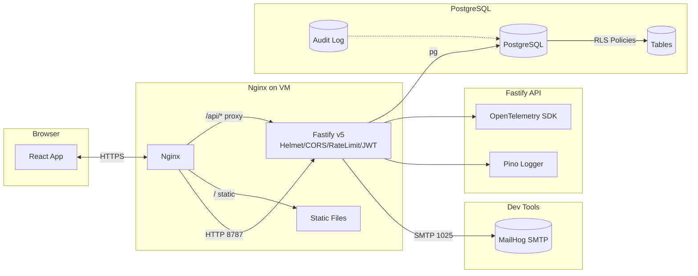

# Shovel Heroes — Secure Starter (Fastify + PostgreSQL + Vite/React)

> **重點**：**Base44 僅作為選配/過渡**（`VITE_USE_REST` = `false` 時停用）。預設採用**自建 REST 後端 + PostgreSQL RLS**，所有敏感資料留在私域。

本腳手架聚焦：**OpenAPI 驅動開發、TDD、最小可觀測性**，並可一鍵在 VM 上以 **Nginx 反向代理** 整合前後端。

## Stack
- 前端：Vite + React + Tailwind
- 後端：Fastify v5（Node 20+）+ PostgreSQL（Row-Level Security）
- API：OpenAPI 3.2.0（`api-spec/openapi.yaml`）
- 測試：Vitest + Supertest
- 安全：Helmet、CORS 白名單、Rate Limit、JWT（之後可接 OIDC）
- 可觀測：Pino 日誌（JSON），OpenTelemetry JS（可送到 OTEL Collector/外部 SaaS）
- 開發郵件：MailHog（本地）

## 快速開始（本機）
```bash
# 1) 安裝依賴
npm install

# 2) 啟動基礎設施（Postgres + MailHog）
docker compose up -d db mailhog

# 3) 產生/套用資料庫 schema（node-pg-migrate）
npm run migrate:up

# 4) 啟動後端
npm run dev:api

# 5) 另開終端啟動前端
npm run dev:web
```

REST 模式（預設）環境：
```
VITE_USE_REST=true
VITE_API_BASE=http://localhost:8787
```

- Frontend (Vite): 5173 (dev)
- Backend (Fastify): 8787（開發遇衝突可遞增；**生產固定 8787**，由 Nginx 反代 `/api`）
- PostgreSQL: 5432
- MailHog: SMTP 1025 / UI 8025

---

## 目錄
```
api-spec/                 # OpenAPI 3.2.0 規格
packages/
  backend/                # Fastify 後端（TypeScript）
  shared-types/           # 由 OpenAPI 產出的 TS 型別（範例 stub）
src/                      # 前端（Vite/React）
infra/
  nginx/                  # Nginx 反代設定（VM）
.github/workflows/        # CI（lint/test/spectral/redocly）
```

## Build (prod)
- 前端設 `VITE_API_BASE=/api`。
- 部署 `infra/nginx/shovelheroes.conf`，執行 `scripts/deploy.sh`（Ubuntu）。
- 使用 `certbot --nginx` 取得/續約憑證。

## Security
- JWT 驗證（@fastify/jwt）+ RBAC 守衛
- PostgreSQL **Row-Level Security**（以 `SET LOCAL app.user_id` 傳遞身份）
- 欄位遮罩：電話等 PII 僅 `can_view_phone` 時返回
- Helmet / CORS 白名單 / Rate Limit
- Audit Log 追加式寫入

## OpenAPI
- 以 `api-spec/openapi.yaml` 為單一真實來源（OAS 3.2）
- `pnpm openapi:lint`（Spectral）
- `pnpm openapi:preview`（Redocly 預覽）
- `pnpm types:openapi` 產出共用 TS 型別

## Tests
- Vitest + Supertest：CRUD、授權、RLS 行為、速率限制
- `scripts/smoke.sh`：本地/VM curl 驗證

> 詳細提示詞與分階段 TDD 指令見 `claude-prompts.md`。

---

## 數位視覺化（Mermaid）

### 系統整合（VM）


### 請求流程（RLS）
```mermaid
sequenceDiagram
  participant B as Browser
  participant N as Nginx
  participant A as Fastify API
  participant DB as Postgres (RLS)
  B->>N: HTTPS GET /api/grids?area=...
  N->>A: Proxy, add X-Forwarded-For/Proto
  A->>A: Verify Bearer JWT → user_id
  A->>DB: SET app.user_id = :user_id; SELECT * FROM grids WHERE ...
  DB-->>A: Rows filtered by RLS USING/WITH CHECK
  A-->>N: 200 JSON
  N-->>B: 200 JSON
```

---

## 開發流程（OpenAPI 驅動 + TDD）
1. 修改 `api-spec/openapi.yaml` → `npm run openapi:lint` → `npm run openapi:preview`
2. `npm run types:openapi` 產出型別
3. 後端 route 實作 / 補測試（Vitest + Supertest）
4. 前端串接（React Query/Fetch）
5. CI 驗收（lint、test、spectral、redocly）

---

## Base44 為**選配/退場中**
- 預設 `VITE_USE_REST=true` 走自建 REST
- 如需過渡支援：切 `VITE_USE_REST=false`，以 `src/api/base44/*` 範例包裝（僅示意，未預設安裝）

---

## 授權
MIT
生成時間：2025-10-01T19:50:16.254674Z
