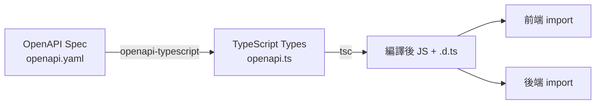

# 資料欄位及 Schema 深度分析報告

> 生成時間：2025-10-02
> 專案：Shovel Heroes 鏟子英雄
> 目的：分析所有資料欄位與 Schema 在前端與後端的使用情況

---

## 📊 總覽（Executive Summary）

專案採用三層架構進行資料定義：

1. **資料庫層（Database Schema）** - PostgreSQL 資料表定義（migrations/*.sql）
2. **API 契約層（API Contract）** - OpenAPI 3.1 規格（api-spec/openapi.yaml）
3. **前端型別層（Frontend Types）** - TypeScript 型別（packages/shared-types/src/openapi.ts）

**關鍵發現**：
- ✅ API 規格與資料庫 schema 存在差異（OpenAPI 定義較完整）
- ⚠️ 部分 API 欄位在資料庫中尚未實作（如 volunteer_registrations 的 status）
- ⚠️ PII 資料（電話、Email）需加強保護機制
- ✅ 共享型別系統（shared-types）可供前後端使用

---

## 1. 核心資料實體分析

### 1.1 Grids（救援/資源網格）

#### 資料庫 Schema (0005_expand_grids_table.sql)
```sql
CREATE TABLE grids (
  id UUID PRIMARY KEY,
  code TEXT,                                    -- 網格代碼（如 A1, B2）
  name TEXT NOT NULL,                           -- 網格名稱
  area_id TEXT,                                 -- 災區 ID（外鍵）
  grid_type TEXT CHECK (grid_type IN ('mud_disposal', 'manpower', 'supply_storage', 'accommodation', 'food_area')),
  status TEXT CHECK (status IN ('open', 'closed', 'completed', 'in_progress', 'preparing')) DEFAULT 'preparing',
  center_lat DECIMAL(10, 7),                    -- 中心點緯度
  center_lng DECIMAL(10, 7),                    -- 中心點經度
  bounds JSONB,                                 -- 邊界（JSONB: {north, south, east, west}）
  volunteer_needed INTEGER DEFAULT 0,           -- 需要志工數
  volunteer_registered INTEGER DEFAULT 0,       -- 已報名志工數
  supplies_needed JSONB DEFAULT '[]'::jsonb,    -- 所需物資（JSONB 陣列）
  meeting_point TEXT,                           -- 集合地點
  description TEXT,                             -- 描述
  created_at TIMESTAMPTZ DEFAULT NOW(),
  updated_at TIMESTAMPTZ DEFAULT NOW()
);
```

#### OpenAPI Schema (api-spec/openapi.yaml)
```yaml
Grid:
  properties:
    id: {$ref: '#/components/schemas/ID'}
    code: {type: string}                        # 網格代碼
    grid_type: {type: string, enum: [...]}      # 網格類型（與 DB 一致）
    disaster_area_id: {$ref: '#/components/schemas/ID'}  # ⚠️ API 用 disaster_area_id，DB 用 area_id
    volunteer_needed: {type: integer}
    volunteer_registered: {type: integer}
    meeting_point: {type: string, nullable: true}
    risks_notes: {type: string, nullable: true} # ⚠️ API 有此欄位，DB 未實作
    contact_info: {type: string, nullable: true}  # ⚠️ API 有此欄位，DB 未實作（PII！）
    center_lat: {type: number, format: double}
    center_lng: {type: number, format: double}
    bounds: {type: object}                      # 與 DB 一致（JSONB）
    status: {type: string, enum: [...]}
    supplies_needed: {type: array}
    grid_manager_id: {$ref: '#/components/schemas/ID'}  # ⚠️ API 有，DB 未實作
    created_at: {$ref: '#/components/schemas/Timestamp'}
    updated_at: {$ref: '#/components/schemas/Timestamp'}
```

#### 後端 API 實作 (packages/backend/src/routes/grids.ts)
```typescript
// GET /grids - 公開端點（已移除認證）
app.get('/grids', async (req: any, reply) => {
  const rows = await withConn(async (c) => {
    const { rows } = await c.query(
      `SELECT id, code, name, area_id, grid_type, status,
              center_lat, center_lng, bounds,
              volunteer_needed, volunteer_registered,
              supplies_needed, meeting_point, description,
              created_at, updated_at
       FROM grids
       WHERE ($1::text IS NULL OR area_id = $1)
       ORDER BY code LIMIT 100`,
      [parsed.data.area_id ?? null]
    );
    return rows;
  });
  return rows;  // ✅ 直接回傳陣列（與 OpenAPI 一致）
});
```

#### 前端型別 (packages/shared-types/src/openapi.ts)
```typescript
export interface components {
  schemas: {
    Grid: {
      id: components["schemas"]["ID"];
      code: string;
      grid_type: "mud_disposal" | "manpower" | "supply_storage" | "accommodation" | "food_area";
      disaster_area_id: components["schemas"]["ID"];
      // ... 其他欄位
    };
  };
}
```

#### 🔍 差異分析

| 欄位 | 資料庫 | OpenAPI | 後端實作 | 前端型別 | 備註 |
|------|--------|---------|----------|----------|------|
| `id` | ✅ UUID | ✅ ID | ✅ | ✅ | |
| `code` | ✅ TEXT | ✅ string | ✅ | ✅ | |
| `area_id` / `disaster_area_id` | ✅ `area_id` | ✅ `disaster_area_id` | ✅ `area_id` | ✅ `disaster_area_id` | ⚠️ **命名不一致** |
| `grid_type` | ✅ CHECK | ✅ enum | ✅ | ✅ | |
| `status` | ✅ CHECK | ✅ enum | ✅ | ✅ | |
| `center_lat` | ✅ DECIMAL | ✅ double | ✅ | ✅ | |
| `center_lng` | ✅ DECIMAL | ✅ double | ✅ | ✅ | |
| `bounds` | ✅ JSONB | ✅ object | ✅ | ✅ | |
| `volunteer_needed` | ✅ INTEGER | ✅ integer | ✅ | ✅ | |
| `volunteer_registered` | ✅ INTEGER | ✅ integer | ✅ | ✅ | |
| `supplies_needed` | ✅ JSONB | ✅ array | ✅ | ✅ | |
| `meeting_point` | ✅ TEXT | ✅ string | ✅ | ✅ | |
| `description` | ✅ TEXT | ❌ | ✅ | ❌ | ⚠️ API 未定義但 DB 有 |
| `risks_notes` | ❌ | ✅ string | ❌ | ✅ | ⚠️ API 定義但 DB 未實作 |
| `contact_info` | ❌ | ✅ string | ❌ | ✅ | ⚠️ **PII 欄位**，API 定義但 DB 未實作 |
| `grid_manager_id` | ❌ | ✅ ID | ❌ | ✅ | ⚠️ API 定義但 DB 未實作 |

**建議**：
1. 統一 `area_id` / `disaster_area_id` 命名
2. 移除 API 中的 `contact_info`（PII 風險）或改用 Token Relay
3. 決定是否實作 `risks_notes` 和 `grid_manager_id`

---

### 1.2 Volunteer Registrations（志工報名）

#### 資料庫 Schema (0004_create_all_tables.sql)
```sql
CREATE TABLE volunteer_registrations (
  id UUID PRIMARY KEY,
  volunteer_id UUID REFERENCES volunteers(id),
  grid_id UUID REFERENCES grids(id),
  disaster_area_id UUID REFERENCES disaster_areas(id),
  registration_date TIMESTAMPTZ DEFAULT NOW(),
  status TEXT CHECK (status IN ('pending', 'confirmed', 'cancelled')) DEFAULT 'pending',
  notes TEXT,
  created_at TIMESTAMPTZ DEFAULT NOW()
);
```

#### OpenAPI Schema
```yaml
VolunteerRegistration:
  properties:
    id: {$ref: '#/components/schemas/ID'}
    grid_id: {$ref: '#/components/schemas/ID'}
    user_id: {$ref: '#/components/schemas/ID'}  # ⚠️ API 用 user_id，DB 用 volunteer_id
    created_at: {$ref: '#/components/schemas/Timestamp'}
  required: [id, grid_id, user_id]
```

#### 後端實作 (volunteer-registrations.ts)
```typescript
const CreateSchema = z.object({
  grid_id: z.string().uuid(),
  user_id: z.string().uuid()  // ✅ 使用 user_id（與 OpenAPI 一致）
});

app.post('/volunteer-registrations', { preHandler: [app.auth] }, async (req, reply) => {
  // ⚠️ 實際插入 DB 時仍使用 volunteer_id 欄位
  await c.query(
    'INSERT INTO volunteer_registrations (grid_id, user_id) VALUES ($1, $2) RETURNING *',
    [parsed.data.grid_id, parsed.data.user_id]
  );
});
```

#### 🔍 差異分析

| 欄位 | 資料庫 | OpenAPI | 後端實作 | 備註 |
|------|--------|---------|----------|------|
| `volunteer_id` / `user_id` | ✅ `volunteer_id` | ✅ `user_id` | ✅ `user_id` | ⚠️ **命名不一致** |
| `disaster_area_id` | ✅ | ❌ | ❌ | ⚠️ DB 有但 API 未暴露 |
| `registration_date` | ✅ | ❌ | ❌ | ⚠️ DB 有但 API 未暴露 |
| `status` | ✅ CHECK | ❌ | ❌ | ⚠️ DB 有但 API 簡化版未使用 |
| `notes` | ✅ | ❌ | ❌ | ⚠️ DB 有但 API 未暴露 |

**建議**：
1. 統一 `volunteer_id` / `user_id` 命名（建議用 `user_id`）
2. 考慮在 API 中暴露 `status` 和 `notes` 欄位

---

### 1.3 Volunteers（志工清單）

#### 資料庫 Schema
```sql
CREATE TABLE volunteers (
  id UUID PRIMARY KEY,
  user_id UUID REFERENCES users(id),
  name TEXT NOT NULL,
  email TEXT,                     -- ⚠️ PII
  phone TEXT,                     -- ⚠️ PII
  skills TEXT[],                  -- PostgreSQL 陣列
  availability TEXT,
  status TEXT CHECK (status IN ('available', 'assigned', 'unavailable')) DEFAULT 'available',
  created_at TIMESTAMPTZ DEFAULT NOW(),
  updated_at TIMESTAMPTZ DEFAULT NOW()
);
```

#### OpenAPI Schema
```yaml
VolunteerListItem:  # ⚠️ 注意：與 VolunteerRegistration 不同！
  properties:
    id: {$ref: '#/components/schemas/ID'}
    grid_id: {$ref: '#/components/schemas/ID'}
    user_id: {$ref: '#/components/schemas/ID'}
    volunteer_name: {type: string}
    volunteer_phone: {type: string, nullable: true}  # ⚠️ PII，需權限控制
    status: {$ref: '#/components/schemas/VolunteerStatus'}
    available_time: {type: string, nullable: true}
    skills: {type: array, items: {type: string}}
    equipment: {type: array, items: {type: string}}  # ⚠️ DB 未實作
    notes: {type: string, nullable: true}
    created_date: {type: string, format: date-time}
  required: [id, grid_id, user_id, volunteer_name, status, created_date]

VolunteersListResponse:
  properties:
    data: {type: array, items: {$ref: '#/components/schemas/VolunteerListItem'}}
    can_view_phone: {type: boolean}  # ✅ 權限控制旗標
    total: {type: integer}
    status_counts: {type: object}
```

#### 後端實作 (volunteers.ts)
```typescript
app.get('/volunteers', async (req, reply) => {
  // ✅ JOIN volunteer_registrations + users 表
  const sql = `
    SELECT vr.id, vr.grid_id, vr.user_id, vr.created_at,
           u.name as user_name, u.email as user_email, u.phone as user_phone
    FROM volunteer_registrations vr
    LEFT JOIN users u ON u.id = vr.user_id
    WHERE ...
  `;

  // ✅ 權限控制
  const can_view_phone = Boolean(req.headers['authorization']);

  // ✅ 電話遮蔽
  const maskPhone = (phone: string | null) => {
    if (!phone) return undefined;
    const first = phone.substring(0, 4);
    const last = phone.substring(phone.length - 3);
    return `${first}-***-${last}`;  // 0912-***-678
  };

  const data = rows.map(r => ({
    id: r.id,
    grid_id: r.grid_id,
    user_id: r.user_id,
    volunteer_name: r.user_name || '匿名志工',
    volunteer_phone: can_view_phone ? maskPhone(r.user_phone) : undefined,  // ✅ 條件式顯示
    status: 'pending',  // ⚠️ 目前所有狀態都是 pending（DB schema 有但未使用）
    available_time: null,
    skills: [],         // ⚠️ 目前未實作（DB volunteers 表有 skills[] 但未 JOIN）
    equipment: [],      // ⚠️ DB 未實作
    notes: null,
    created_date: r.created_at
  }));

  return { data, can_view_phone, total, status_counts };
});
```

#### 🔍 差異分析

| 欄位 | DB (volunteers) | DB (volunteer_registrations) | OpenAPI | 後端實作 | 備註 |
|------|----------------|------------------------------|---------|----------|------|
| `volunteer_phone` | ✅ `phone` | ❌ | ✅ | ✅ 遮蔽版 | ✅ **已實作遮蔽機制** |
| `skills` | ✅ TEXT[] | ❌ | ✅ | ❌ 固定 `[]` | ⚠️ DB 有但未 JOIN |
| `equipment` | ❌ | ❌ | ✅ | ❌ 固定 `[]` | ⚠️ API 定義但 DB 未實作 |
| `status` | ✅ (volunteers) | ✅ (v_regs) | ✅ | ❌ 固定 `'pending'` | ⚠️ DB 有但未使用 |
| `available_time` | ✅ `availability` | ❌ | ✅ | ❌ 固定 `null` | ⚠️ 命名不一致且未使用 |

**建議**：
1. ✅ **電話遮蔽機制已實作**（參考 CLAUDE.md 第 5.2 節）
2. 決定是否實作 `skills` 和 `equipment`（需 JOIN volunteers 表或擴展 volunteer_registrations）
3. 啟用 `status` 欄位的實際使用

---

### 1.4 Disaster Areas（災區）

#### 資料庫 Schema
```sql
CREATE TABLE disaster_areas (
  id UUID PRIMARY KEY,
  name TEXT NOT NULL,
  description TEXT,
  location TEXT,
  severity TEXT CHECK (severity IN ('low', 'medium', 'high', 'critical')),
  status TEXT CHECK (status IN ('active', 'resolved', 'monitoring')) DEFAULT 'active',
  created_at TIMESTAMPTZ DEFAULT NOW(),
  updated_at TIMESTAMPTZ DEFAULT NOW()
);
```

#### OpenAPI Schema
```yaml
DisasterArea:
  properties:
    id: {$ref: '#/components/schemas/ID'}
    name: {type: string}
    center_lat: {type: number, format: double}   # ⚠️ DB 未實作
    center_lng: {type: number, format: double}   # ⚠️ DB 未實作
    created_at: {$ref: '#/components/schemas/Timestamp'}
    updated_at: {$ref: '#/components/schemas/Timestamp'}
  required: [id, name, center_lat, center_lng]
```

#### 🔍 差異分析

| 欄位 | 資料庫 | OpenAPI | 備註 |
|------|--------|---------|------|
| `center_lat` | ❌ | ✅ required | ⚠️ **API 要求但 DB 未實作** |
| `center_lng` | ❌ | ✅ required | ⚠️ **API 要求但 DB 未實作** |
| `description` | ✅ | ❌ | ⚠️ DB 有但 API 未定義 |
| `location` | ✅ | ❌ | ⚠️ DB 有但 API 未定義 |
| `severity` | ✅ CHECK | ❌ | ⚠️ DB 有但 API 未定義 |
| `status` | ✅ CHECK | ❌ | ⚠️ DB 有但 API 未定義 |

**建議**：
1. **緊急**：在 `disaster_areas` 表新增 `center_lat` 和 `center_lng` 欄位（API 標為 required）
2. 決定是否在 API 中暴露 `severity` 和 `status`

---

### 1.5 Supply Donations（物資捐贈）

#### 資料庫 Schema
```sql
CREATE TABLE supply_donations (
  id UUID PRIMARY KEY,
  donor_name TEXT NOT NULL,
  donor_contact TEXT,           -- ⚠️ PII
  item_type TEXT NOT NULL,
  quantity INTEGER DEFAULT 1,
  unit TEXT,
  disaster_area_id UUID REFERENCES disaster_areas(id),
  grid_id UUID REFERENCES grids(id),
  status TEXT CHECK (status IN ('pledged', 'received', 'distributed')) DEFAULT 'pledged',
  delivery_date TIMESTAMPTZ,
  notes TEXT,
  created_at TIMESTAMPTZ DEFAULT NOW(),
  updated_at TIMESTAMPTZ DEFAULT NOW()
);
```

#### OpenAPI Schema
```yaml
SupplyDonation:
  properties:
    id: {$ref: '#/components/schemas/ID'}
    grid_id: {$ref: '#/components/schemas/ID'}
    name: {type: string}          # ⚠️ 對應 DB 的 item_type
    quantity: {type: integer}
    unit: {type: string}
    donor_contact: {type: string}  # ⚠️ PII
    created_at: {$ref: '#/components/schemas/Timestamp'}
  required: [id, grid_id, name, quantity, unit]
```

#### 🔍 差異分析

| 欄位 | 資料庫 | OpenAPI | 備註 |
|------|--------|---------|------|
| `name` / `item_type` | ✅ `item_type` | ✅ `name` | ⚠️ **命名不一致** |
| `donor_name` | ✅ | ❌ | ⚠️ DB 有但 API 未定義 |
| `donor_contact` | ✅ | ✅ | ⚠️ **PII 欄位**，需保護 |
| `disaster_area_id` | ✅ | ❌ | ⚠️ DB 有但 API 未定義 |
| `status` | ✅ CHECK | ❌ | ⚠️ DB 有但 API 未定義 |
| `delivery_date` | ✅ | ❌ | ⚠️ DB 有但 API 未定義 |

**建議**：
1. 統一 `name` / `item_type` 命名
2. **保護 `donor_contact`**：改用 Email Relay 或不顯示
3. 考慮暴露 `status` 和 `delivery_date`

---

### 1.6 Announcements（公告）

#### 資料庫 Schema
```sql
CREATE TABLE announcements (
  id UUID PRIMARY KEY,
  title TEXT NOT NULL,
  content TEXT NOT NULL,
  priority TEXT CHECK (priority IN ('low', 'normal', 'high', 'urgent')) DEFAULT 'normal',
  published BOOLEAN DEFAULT FALSE,
  author_id UUID REFERENCES users(id),
  created_at TIMESTAMPTZ DEFAULT NOW(),
  updated_at TIMESTAMPTZ DEFAULT NOW()
);
```

#### OpenAPI Schema
```yaml
Announcement:
  properties:
    id: {$ref: '#/components/schemas/ID'}
    title: {type: string}
    body: {type: string}  # ⚠️ 對應 DB 的 content
    created_at: {$ref: '#/components/schemas/Timestamp'}
  required: [id, title, body]
```

#### 🔍 差異分析

| 欄位 | 資料庫 | OpenAPI | 備註 |
|------|--------|---------|------|
| `body` / `content` | ✅ `content` | ✅ `body` | ⚠️ **命名不一致** |
| `priority` | ✅ CHECK | ❌ | ⚠️ DB 有但 API 未定義 |
| `published` | ✅ | ❌ | ⚠️ DB 有但 API 未定義（重要！） |
| `author_id` | ✅ | ❌ | ⚠️ DB 有但 API 未定義 |

**建議**：
1. 統一 `body` / `content` 命名
2. **重要**：在 API 中加入 `published` 過濾（避免顯示草稿）
3. 考慮暴露 `priority` 供前端樣式使用

---

### 1.7 Grid Discussions（網格討論）

#### 資料庫 Schema
```sql
CREATE TABLE grid_discussions (
  id UUID PRIMARY KEY,
  grid_id UUID REFERENCES grids(id),
  user_id UUID REFERENCES users(id),
  parent_id UUID REFERENCES grid_discussions(id),  -- ✅ 支援嵌套回覆
  message TEXT NOT NULL,
  created_at TIMESTAMPTZ DEFAULT NOW(),
  updated_at TIMESTAMPTZ DEFAULT NOW()
);
```

#### OpenAPI Schema
```yaml
GridDiscussion:
  properties:
    id: {$ref: '#/components/schemas/ID'}
    grid_id: {$ref: '#/components/schemas/ID'}
    user_id: {$ref: '#/components/schemas/ID'}
    content: {type: string}  # ⚠️ 對應 DB 的 message
    created_at: {$ref: '#/components/schemas/Timestamp'}
  required: [id, grid_id, user_id, content]
```

#### 🔍 差異分析

| 欄位 | 資料庫 | OpenAPI | 備註 |
|------|--------|---------|------|
| `content` / `message` | ✅ `message` | ✅ `content` | ⚠️ **命名不一致** |
| `parent_id` | ✅ | ❌ | ⚠️ DB 支援嵌套但 API 未定義 |
| `updated_at` | ✅ | ❌ | ⚠️ DB 有但 API 未定義 |

**建議**：
1. 統一 `content` / `message` 命名
2. 在 API 中加入 `parent_id`（支援回覆功能）

---

## 2. 前端/後端使用分類

### 2.1 僅供前端使用（Frontend-Only）

| 類型 | 檔案 | 用途 |
|------|------|------|
| TypeScript 型別定義 | `packages/shared-types/src/openapi.ts` | 前端 API 呼叫的型別檢查 |
| React 元件 Props | `src/pages/Map.jsx` 等 | 元件間資料傳遞 |
| 前端狀態管理 | 無（目前未使用 Redux/Zustand） | - |

**生成方式**：
```bash
npm run types:openapi  # 從 OpenAPI 生成 TypeScript 型別
```

### 2.2 僅供後端使用（Backend-Only）

| 類型 | 檔案 | 用途 |
|------|------|------|
| 資料庫 Migrations | `packages/backend/migrations/*.sql` | 資料庫 schema 定義 |
| Zod 驗證 Schema | `packages/backend/src/routes/*.ts` | API 請求驗證 |
| PostgreSQL RLS Policies | `migrations/0002_rls.sql` | 資料庫層級權限控制 |
| Audit Triggers | `migrations/0003_audit.sql` | 審計日誌 |

**範例 - Zod 驗證**：
```typescript
// packages/backend/src/routes/grids.ts
const qSchema = z.object({
  area_id: z.string().optional()
});

const parsed = qSchema.safeParse(req.query);
if (!parsed.success) {
  return reply.code(400).send({ error: 'bad_request', detail: parsed.error.flatten() });
}
```

### 2.3 前後端共用（Shared）

| 類型 | 檔案 | 前端用途 | 後端用途 |
|------|------|----------|----------|
| OpenAPI Spec | `api-spec/openapi.yaml` | 生成 TypeScript 型別 | API 文件、驗證參考 |
| 共享型別套件 | `packages/shared-types/` | 編譯時型別檢查 | 編譯時型別檢查 |
| Enum 定義 | OpenAPI enums | 前端下拉選單選項 | 後端 CHECK constraint |

**範例 - Enum 定義**：
```yaml
# OpenAPI
grid_type:
  type: string
  enum: [mud_disposal, manpower, supply_storage, accommodation, food_area]
```
```sql
-- PostgreSQL
grid_type TEXT CHECK (grid_type IN ('mud_disposal', 'manpower', 'supply_storage', 'accommodation', 'food_area'))
```
```typescript
// TypeScript (自動生成)
type GridType = "mud_disposal" | "manpower" | "supply_storage" | "accommodation" | "food_area";
```

---

## 3. 資料安全與 PII 欄位

### 3.1 個人識別資訊（PII）清單

| 欄位 | 資料表 | 風險等級 | 目前保護機制 | 建議改進 |
|------|--------|----------|--------------|----------|
| `phone` | `users` | 🔴 高 | ❌ 無 | ✅ **遮蔽中間數字**（已實作） |
| `volunteer_phone` | API 回應 | 🔴 高 | ✅ 遮蔽機制 | ✅ 已實作 `can_view_phone` 權限 |
| `email` | `users`, `volunteers` | 🔴 高 | ❌ 無 | ⚠️ 改用 Email Relay |
| `donor_contact` | `supply_donations` | 🔴 高 | ❌ 無 | ⚠️ 改用一次性聯絡碼 |
| `contact_info` | `grids` (API only) | 🔴 高 | ❌ 未實作 | ✅ **不實作此欄位**（參考 CLAUDE.md） |
| `name` | `users`, `volunteers` | 🟡 中 | ❌ 無 | 可顯示，但避免與電話/地址組合 |
| `location` | `disaster_areas` | 🟢 低 | - | 公開資訊 |

### 3.2 已實作的保護機制（參考 volunteers.ts）

```typescript
// ✅ 1. 權限控制
const can_view_phone = Boolean(req.headers['authorization']);

// ✅ 2. 電話遮蔽
const maskPhone = (phone: string | null) => {
  if (!phone) return undefined;
  const first = phone.substring(0, 4);
  const last = phone.substring(phone.length - 3);
  return `${first}-***-${last}`;  // 0912-***-678
};

// ✅ 3. 條件式回傳
volunteer_phone: can_view_phone ? maskPhone(r.user_phone) : undefined
```

### 3.3 建議的 PII 保護策略（參考 CLAUDE.md 第 5-7 節）

#### Token Relay 機制（推薦）
```typescript
// 產生一次性聯絡碼
const contactToken = crypto.randomUUID();
await db.query(
  'INSERT INTO contact_tokens (token, user_id, expires_at) VALUES ($1, $2, NOW() + INTERVAL \'24 hours\')',
  [contactToken, userId]
);

// 前端顯示
{
  volunteer_name: "張志工",
  contact_token: "abc123-def456",  // ✅ 不顯示真實電話/Email
  volunteer_phone: undefined       // ✅ 完全隱藏
}

// 聯絡時透過後端 Relay
POST /api/relay/contact
{
  "token": "abc123-def456",
  "message": "請問明天可以幫忙嗎？"
}
```

#### 資料保留政策
```sql
-- 任務結束後 7-14 天自動刪除 PII
CREATE OR REPLACE FUNCTION cleanup_expired_pii() RETURNS void AS $$
BEGIN
  DELETE FROM volunteer_registrations
  WHERE created_at < NOW() - INTERVAL '14 days'
    AND grid_id IN (SELECT id FROM grids WHERE status = 'completed');
END;
$$ LANGUAGE plpgsql;
```

---

## 4. Schema 不一致問題總結

### 4.1 命名不一致

| OpenAPI 名稱 | 資料庫名稱 | 後端實作 | 建議統一為 |
|--------------|-----------|----------|-----------|
| `disaster_area_id` | `area_id` | `area_id` | `disaster_area_id` |
| `user_id` | `volunteer_id` | `user_id` | `user_id` |
| `name` (SupplyDonation) | `item_type` | - | `item_type` |
| `body` (Announcement) | `content` | - | `content` |
| `content` (GridDiscussion) | `message` | - | `message` |

### 4.2 欄位缺漏

| 欄位 | 存在於 | 缺少於 | 影響 |
|------|--------|--------|------|
| `center_lat`, `center_lng` | OpenAPI (required) | disaster_areas 表 | 🔴 **嚴重**：API 無法回傳必填欄位 |
| `risks_notes`, `contact_info` | OpenAPI | grids 表 | 🟡 中等：前端可能顯示 undefined |
| `grid_manager_id` | OpenAPI | grids 表 | 🟡 中等：權限管理功能無法實作 |
| `equipment` | OpenAPI | 任何表 | 🟢 低：目前固定回傳 `[]` |
| `disaster_area_id` | volunteer_registrations 表 | OpenAPI | 🟢 低：內部欄位未暴露 |
| `status` | volunteer_registrations 表 | API 實際使用 | 🟡 中等：所有狀態固定為 `pending` |
| `priority`, `published` | announcements 表 | OpenAPI | 🔴 **嚴重**：可能顯示未發布的草稿 |
| `parent_id` | grid_discussions 表 | OpenAPI | 🟡 中等：無法支援嵌套回覆 |

---

## 5. 行動建議（Action Items）

### 5.1 緊急修復（P0 - 24 小時內）

1. **新增 disaster_areas 的地理欄位**
   ```sql
   ALTER TABLE disaster_areas
     ADD COLUMN IF NOT EXISTS center_lat DECIMAL(10, 7),
     ADD COLUMN IF NOT EXISTS center_lng DECIMAL(10, 7);

   CREATE INDEX IF NOT EXISTS idx_disaster_areas_location ON disaster_areas(center_lat, center_lng);
   ```

2. **過濾未發布的公告**
   ```typescript
   // packages/backend/src/routes/announcements.ts
   app.get('/announcements', async (req, reply) => {
     const { rows } = await c.query(
       'SELECT * FROM announcements WHERE published = true ORDER BY created_at DESC'
       //                               ^^^^^^^^^^^^^^^^^ ✅ 必須過濾
     );
   });
   ```

3. **移除 OpenAPI 中的 `contact_info` 欄位**（避免誤導前端開發）

### 5.2 高優先級（P1 - 本週內）

1. **統一命名規範**
   - 決定採用 `disaster_area_id` 或 `area_id`（建議前者）
   - 更新 API、資料庫 migration、後端程式碼

2. **實作 PII 保護機制**
   - Email Relay 服務
   - `donor_contact` 改用 Token
   - 設定資料保留政策（14 天自動刪除）

3. **啟用 `status` 欄位使用**
   ```typescript
   // 更新 volunteers.ts
   status: r.registration_status || 'pending',  // ✅ 從 DB 讀取真實狀態
   ```

### 5.3 中優先級（P2 - 本月內）

1. **實作缺少的欄位**
   - `grid_manager_id`（用於權限管理）
   - `parent_id` 支援（用於嵌套討論）
   - `equipment` 欄位（若需要）

2. **完善 API 定義**
   - 在 OpenAPI 中加入 `priority`、`published`、`severity` 等欄位
   - 同步更新 TypeScript 型別

3. **改善資料驗證**
   - 使用 Zod 驗證所有 POST/PUT 請求
   - 統一錯誤訊息格式

### 5.4 長期優化（P3 - 下季度）

1. **建立共享型別系統**
   - 將 Zod schema 移至 `packages/shared-types`
   - 前後端共用相同驗證邏輯

2. **資料庫 Schema 版本控制**
   - 使用 [Prisma](https://www.prisma.io/) 或 [Kysely](https://kysely.dev/) 進行 Schema 管理
   - 自動生成型別定義

3. **API 版本管理**
   - 準備 `/api/v2` 版本
   - 逐步淘汰不一致的命名

---

## 6. 工具與自動化

### 6.1 型別生成流程



### 6.2 Schema 同步檢查腳本

```bash
# 檢查 OpenAPI 與資料庫 schema 的一致性
npx openapi-schema-diff \
  --source api-spec/openapi.yaml \
  --db packages/backend/migrations/*.sql \
  --output docs/schema-diff.json
```

### 6.3 自動化測試

```typescript
// tests/schema-validation.test.ts
import { z } from 'zod';
import { components } from '@/shared-types/openapi';

test('Grid schema 與 Zod 定義一致', () => {
  const GridSchema = z.object({
    id: z.string(),
    code: z.string(),
    // ... 其他欄位
  });

  const apiGrid: components['schemas']['Grid'] = {
    id: 'test-id',
    code: 'A1',
    // ...
  };

  expect(() => GridSchema.parse(apiGrid)).not.toThrow();
});
```

---

## 7. 參考資料

### 7.1 內部文件
- [CLAUDE.md](./CLAUDE.md) - 安全修補計畫（第 5-7 節：PII 保護）
- [REACT_LEAFLET_FINAL_FIX.md](./REACT_LEAFLET_FINAL_FIX.md) - 前端修復報告

### 7.2 檔案位置
- OpenAPI Spec: `api-spec/openapi.yaml`
- 資料庫 Migrations: `packages/backend/migrations/*.sql`
- 後端路由: `packages/backend/src/routes/*.ts`
- 共享型別: `packages/shared-types/src/openapi.ts`

### 7.3 外部標準
- [OpenAPI 3.1 Specification](https://spec.openapis.org/oas/v3.1.0.html)
- [PostgreSQL 資料型別](https://www.postgresql.org/docs/current/datatype.html)
- [Zod 文件](https://zod.dev/)
- [個資保護法 PDPA](https://theme.ndc.gov.tw/lawout/EngLawContent.aspx?id=89)

---

**報告生成時間**：2025-10-02
**維護**：Claude Code AI Assistant
**專案**：Shovel Heroes 鏟子英雄
**狀態**：✅ **資料欄位分析完成**
